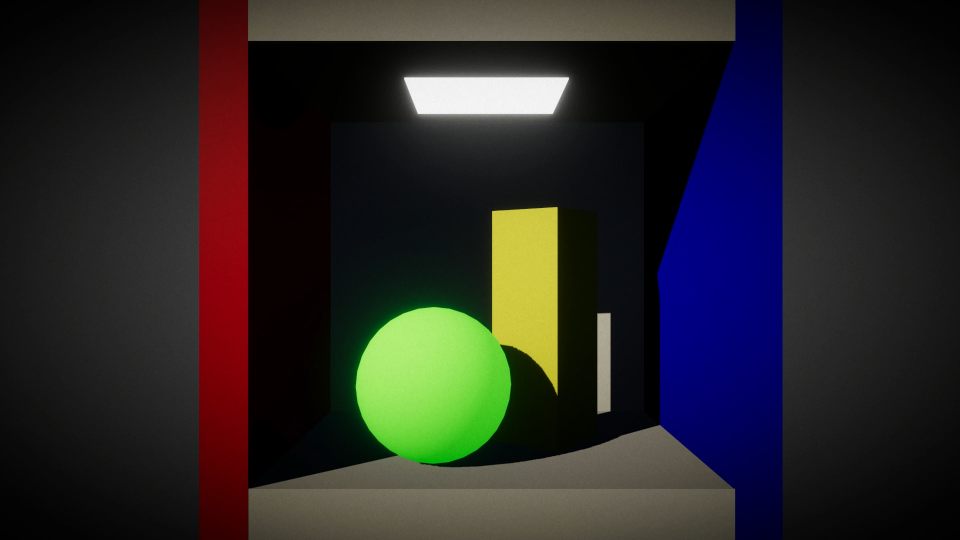
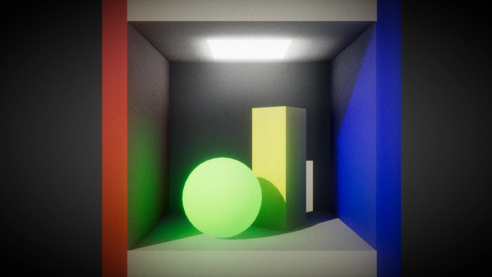

# VoxelGI-URP

基于体素的全局光照（Voxel-based Global Illumination）方案，运行在 **Unity 2022.3 + URP 14** 上。

原始项目：[BonheurTing/VoxelGI (Built-in)](https://github.com/BonheurTing/VoxelGI) — 迁移至 URP 并以 RendererFeature 形式实现。

> 花了大约劳动节四天，把我几个订阅的Token都烧得差不多了。  
> 使用模型：  
> DeepSeek-V4-Pro（前期迁移计划，第一版URP代码）  
> Opus-4.6（修复核心代码，使管线可以基本运行起来）  
> GPT-5.3-Codex, Gemini-3-Pro （后期修复，性能优化）  

## 效果展示

| 关闭 VoxelGI | 开启 VoxelGI |
|:---:|:---:|
|  |  |

## 管线概览

```
体素化 → 直接光照 → 间接光照（二次反弹） → Cone Tracing → 时域滤波 → 双边滤波 → 合成输出
```

通过体素化场景写入 3D GBuffer，Compute Shader 计算直接/间接光照，屏幕空间 Cone Tracing 采样 3D 光照体素，最终与直接光合成输出。

## 特性

- **3D 体素化**：Geometry Shader 三轴投影 + 保守光栅化 + InterlockedMax 原子写入
- **直接光照**：Compute Shader 计算体素空间的太阳光直射与阴影
- **间接光照**：Fibonacci 球面分布 + 半球 Cone Tracing，支持二次反弹
- **屏幕空间 Cone Tracing**：Halton 序列 + 蓝噪声抖动
- **降噪**：Motion Vector 重投影时域滤波 + Poisson Disk 双边滤波
- **可视化 Box**：`VoxelGIVolume` 组件定义体素化区域，支持 Gizmos 线框预览
- **调试模式**：Ray Marching 可视化各中间通道（Albedo/Normal/Emissive/Lighting 等）
- **遮挡体**：`VXGIBlocker.shader` 实现屏幕不可见但参与体素阴影的遮挡体

## 性能优化

- **管线耗时从最初的 `0.2ms` 减少到 `0.09ms`**
- 体素化阶段使用 `DrawRenderers` 兼容 SRP Batcher，替代旧代码的手动遍历绘制物体
- 3D GBuffer 从 4 张收敛为 2 张主纹理，光照阶段每次采样减少 2 次 3D 纹理读取
- ShadowMap 视锥体范围根据体素区域自动优化
- Cone Tracing 阶段无限远像素 Early-Out，预计算最长射线距离

## 快速开始

> 可以直接打开搭建好的测试场景：Assets\Scenes\SampleScene.unity 

1. 将 `Assets/VXGI/` 文件夹放入你的 URP 项目
2. 在 URP Renderer 的 `Renderer Features` 中添加 `VoxelGIRendererFeature`
3. 场景物体使用 `VoxelGI/Lit` 材质（或确保材质包含 `VoxelGI_Voxelization` 和 `VoxelGI_Shadow` Pass）
4. 场景中放置一个 `VoxelGIVolume` 组件，调整其 Transform 来定义体素化区域
5. 配置各项参数（详见下文）

## 项目结构

```
Assets/VXGI/
├── Scripts/
│   ├── VoxelGIRendererFeature.cs     # 主入口：RendererFeature + 配置 + 资源管理
│   ├── VoxelGIVolume.cs              # 体素化区域定义组件（单例）
│   ├── VoxelGIProfiler.cs            # CPU 性能统计工具
│   └── Passes/
│       ├── VoxelizationPass.cs       # Pass 1：体素化 + 阴影图
│       ├── VoxelLightingComputePass.cs  # Pass 2：直接光照 + Mipmap + 间接光照
│       ├── ConeTracingPass.cs        # Pass 3：屏幕空间 Cone Tracing
│       ├── TemporalFilterPass.cs     # Pass 4：时域滤波
│       ├── BilateralFilterPass.cs    # Pass 5：双边滤波降噪
│       └── CombinePass.cs            # Pass 6：合成 + 调试可视化
└── Shaders/
    ├── VoxelGI_URP.shader            # Hidden Shader（ConeTracing/Temporal/Combine/Debug）
    ├── Lit.shader                    # 场景物体材质（Forward + Voxelization + Shadow）
    ├── VoxelGICompute.compute        # 主 Compute Shader（6 个 Kernel）
    └── VXGIBlocker.shader            # 遮挡体 Shader
```

## 配置项

### Voxelization（体素化）
| 参数 | 默认值 | 说明 |
|------|--------|------|
| ShadowMapResolution | 1024 | 阴影图分辨率 |
| VoxelTextureResolution | 256 | 体素纹理分辨率（256³） |
| VoxelizationLayerMask | Everything | 体素化 Layer 过滤 |
| EnableConservativeRasterization | false | 保守光栅化开关 |

### DirectLighting（直接光照）
| 参数 | 默认值 | 说明 |
|------|--------|------|
| LightIndensityMulti | 1.5 | 光照强度乘数 |
| EmissiveMulti | 1.5 | 自发光乘数 |
| ShadowSunBias | 0.25 | 阴影偏移 |
| ShadowNormalBias | 1.0 | 法线偏移 |

### IndirectLighting（间接光照）
| 参数 | 默认值 | 说明 |
|------|--------|------|
| EnableSecondBounce | true | 二次反弹开关 |
| ConeTraceQuality | VeryLow | 间接光质量（VeryLow/Low/Mid/High） |
| IndirectLightingScale | 2.0 | 间接光强度 |
| IndirectLightingMaxStepNum | 12 | 最大步进次数 |

### ConeTracing（屏幕追踪）
| 参数 | 默认值 | 说明 |
|------|--------|------|
| ScreenMaxStepNum | 32 | 最大步进 |
| ScreenScale | 1.0 | 强度缩放 |
| ScreenConeAngle | 120° | 锥体角度 |

### TemporalFilter（时域滤波）
| 参数 | 默认值 | 说明 |
|------|--------|------|
| EnableTemporalFilter | true | 开关 |
| TemporalBlendAlpha | 0.005 | 混合权重 |
| ClampAABBScale | 1.2 | 颜色钳制范围 |

### BilateralFilter（双边滤波）
| 参数 | 默认值 | 说明 |
|------|--------|------|
| EnableBilateralFilter | true | 开关 |
| BilateralSamplerRadius | 6.0 | 采样半径 |
| DepthThresholdLowerBound | 0.1 | 深度阈值下界 |

## 重要注意事项

1. 场景物体 Shader 必须包含 `LightMode = "DepthNormals"` 的 Pass，否则法线纹理为空
2. URP 14 的法线纹理名为 `_CameraNormalsTexture`（view space），非 Built-in 管线的 `_CameraDepthNormalsTexture`
3. 体素化使用 `SetRandomWriteTarget` + `InterlockedMax` 原子写入 3D 纹理
4. Unity 不支持 3D 纹理自动 Mipmap，需 Compute Shader 手动生成
5. 每个相机独立维护时域滤波历史帧

## 后续计划

- 静态场景体素化和光照持久化存储（3D GBuffer + 3D Lightmap），避免每帧计算
- 静态场景基础上增量更新动态物体
- 支持多光源

## 详细文档

[VoxelGI 技术参考文档](docs/VoxelGI_TechnicalReference.md)

## 开源协议
[MIT](LICENSE)